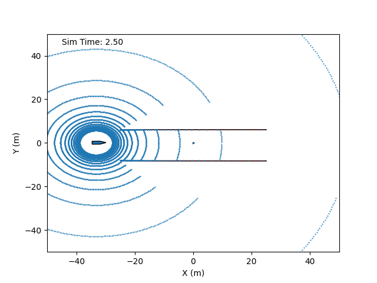
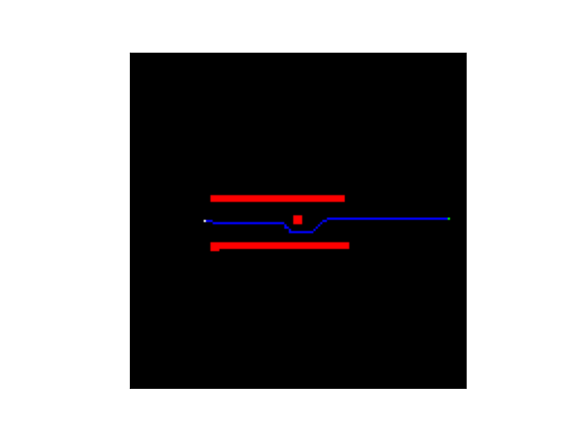
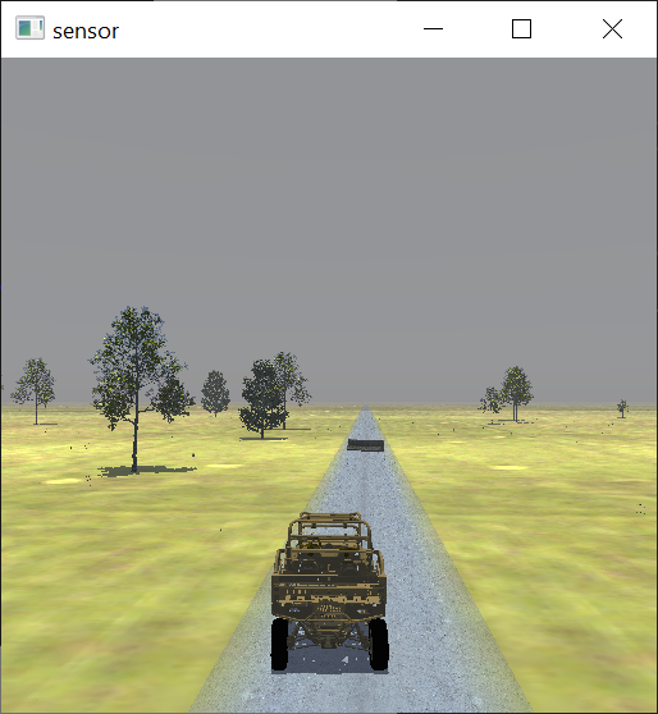

# NATURE-Lite
Navigating All Terrains Using Robotic Exploration (NATURE)-Lite is a lightweight, end-to-end autonomy stack for Ackermann-steered wheeled vehicles implemented in Python. 

NATURE-Lite is an easy-to-use, lightweight stack that is conceptually similar to the full-featured [NATURE autonomous ground vehicle stack](https://github.com/CGoodin/nature-stack), a ROS-based autonomy stack for off-road ground vehicles implemented in C++. In contrast, NATURE-Lite is standalone python library with no ROS dependency. **The primary purpose of NATURE-Lite is as a teaching and learning tool for students first encountering ground vehicle autonomy.**

NATURE-Lite consists of 3 autonomy modules - perception, planning, and control. The perception module is a slope-based obstacle detection algorithm that takes a 3D lidar point cloud - registered to local world coordinates - as input and outputs an occupancy grid. 

The path planning module uses the artificial potential field method, and the steering control uses the pure-pursuit method. The planning and control modules are adapted from the [PythonRobotics](https://github.com/AtsushiSakai/PythonRobotics) repository by Atsushi Sakai. 

## Installation
NATURE-Lite requires [Python-3](https://www.python.org/downloads/) and [NumPy](https://numpy.org/install/). Once these are installed, NATURE-Lite can be cloned:
```console
$git clone https://github.com/CGoodin/nature-lite.git
```

To run the example:
```console
$cd nature-lite/src
$python sim_example.py
```

This will open a simulation window like the one shown below, which shows an obstacle detection and avoidance test with the vehicle traveling from left to right across the screen. The obstacle is located in the middle of the test area, with two walls bounding the lane on both sides. 


The output of the perception and path planning is also shown below. The planned path is in blue, while the detected obstacle points are in red. The goal point is in green. 


A simple lidar and vehicle simulator are included with the NATURE-Lite for demonstaration purposes. If desired, the simulation can be replaced with a more realistic simulator like the [MSU Autonomous Vehicle Simulator (MAVS)](https://www.cavs.msstate.edu/capabilities/mavs.php).

If you have [installed MAVS](https://mavs-documentation.readthedocs.io/en/latest/MavsBuildInstructions/) on your computer, then you can run the MAVS example by editing line 14 of the [MAVS simulation example](https://github.com/CGoodin/nature-lite/blob/main/src/mavs_sim_example.py) to point to your local installation of MAVS. Then, you can run the MAVS example with the command:
```console
#python mavs_sim_example.py
```

If successful, a rendering window depicting the MAVS simulation will appear, as shown below, along with the perception output window shown above.
